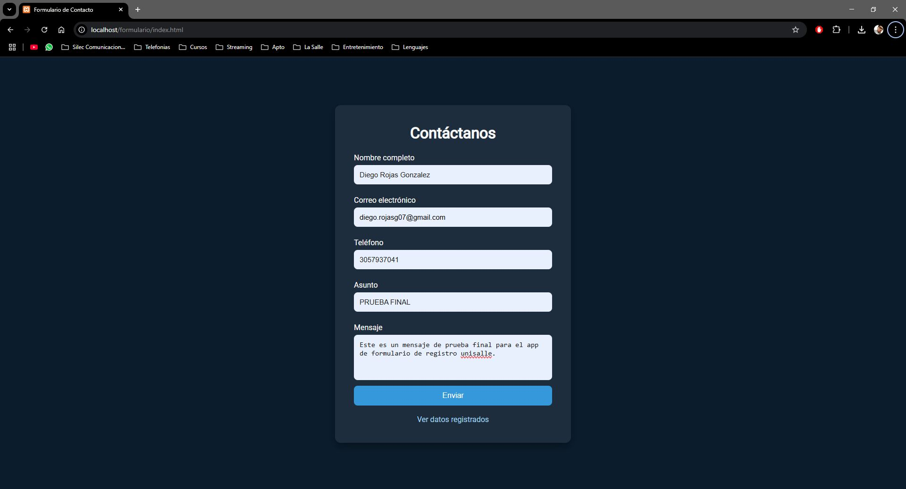
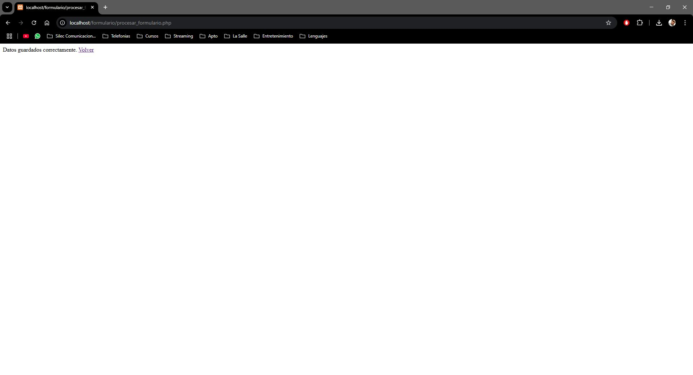
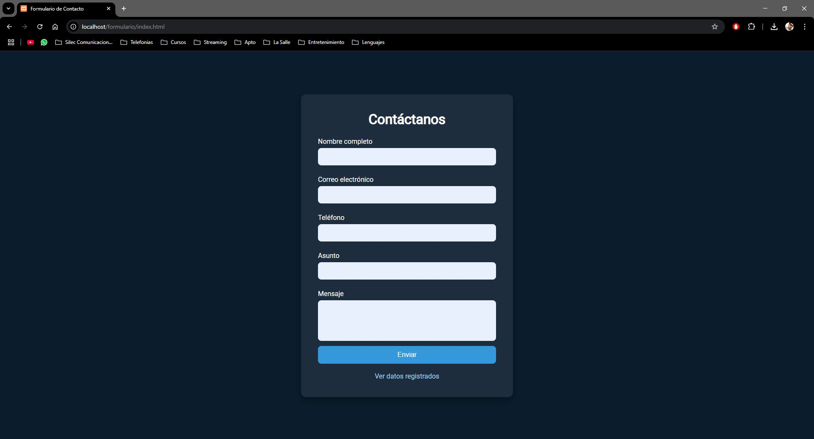
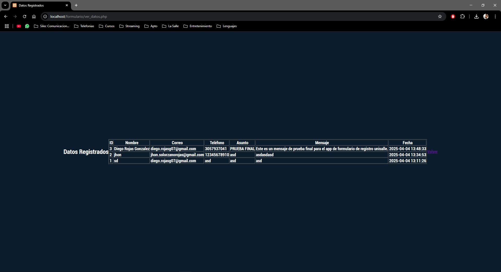

# INGENIERIA DE SOFTWARE - ACTIVIDAD 5 -  FORMULARIO DE CONTACTO

## 📏 Descripción
Este proyecto es un formulario web que permite a los usuarios enviar información (nombre, correo, teléfono, asunto, mensaje) y almacena los datos en una base de datos MySQL. Además, cuenta con una página para visualizar todos los registros enviados.

## Tecnologías Utilizadas
- HTML5
- CSS3
- PHP
- MySQL
- XAMPP (Servidor local)

## Estructura
- **/FORMULARIO**
    - index.html **Formulario principal**
    - styles.css **Estilos personalizados**
    - procesar_formulario.php **Lógica para procesar y guardar datos**
    - ver_datos.php **Página para visualizar los registros**
    - mostrar_datos.php **Opcional:archivo auxiliar de visualización** 
    - README.md **Documentacipon del proyecto**

## 📌 Requisitos Previos
- Tener instalado [XAMPP](https://www.apachefriends.org/index.html)
- Apache y MySQL deben estar activados
- PHP habilitado (XAMPP ya lo incluye)
- Navegador web actualizado (Chrome, Firefox, Edge)

## 🚀 Configuración Inicial
1. Clona este repositorio o copia los archivos en la ruta:
2. Abre **phpMyAdmin** y crea una base de datos llamada:
```sql
formularios_db
CREATE TABLE contactos (
  id INT AUTO_INCREMENT PRIMARY KEY,
  nombre VARCHAR(100) NOT NULL,
  correo VARCHAR(100) NOT NULL,
  telefono VARCHAR(20),
  asunto VARCHAR(100),
  mensaje TEXT,
  fecha TIMESTAMP DEFAULT CURRENT_TIMESTAMP
);
```
## 🚀 Cómo Usar
1. Abre tu navegador e ingresa a: http://localhost/formulario/index.html
2. **Rellena** el formulario y haz clic en **Enviar**

3. Despues de enviado confirara que lso datos fueron guardados

5. Seguido haz clic en **Volver** para regresar al formulario

6. Por ultimo haz clic en **Ver datos registrados**
7. Esto te redirecionara a http://localhost/formulario/ver_datos.php (Aqui podras visualizar la informacion almacenada previamente)


